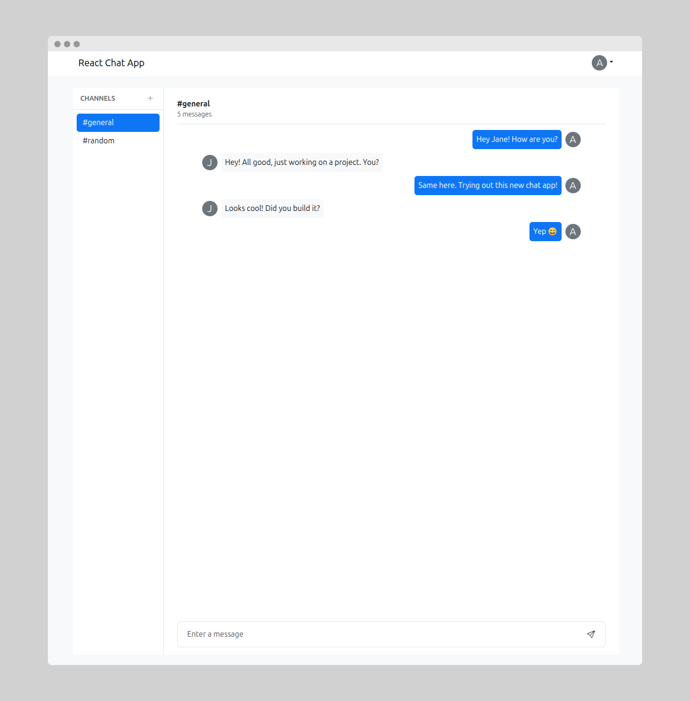
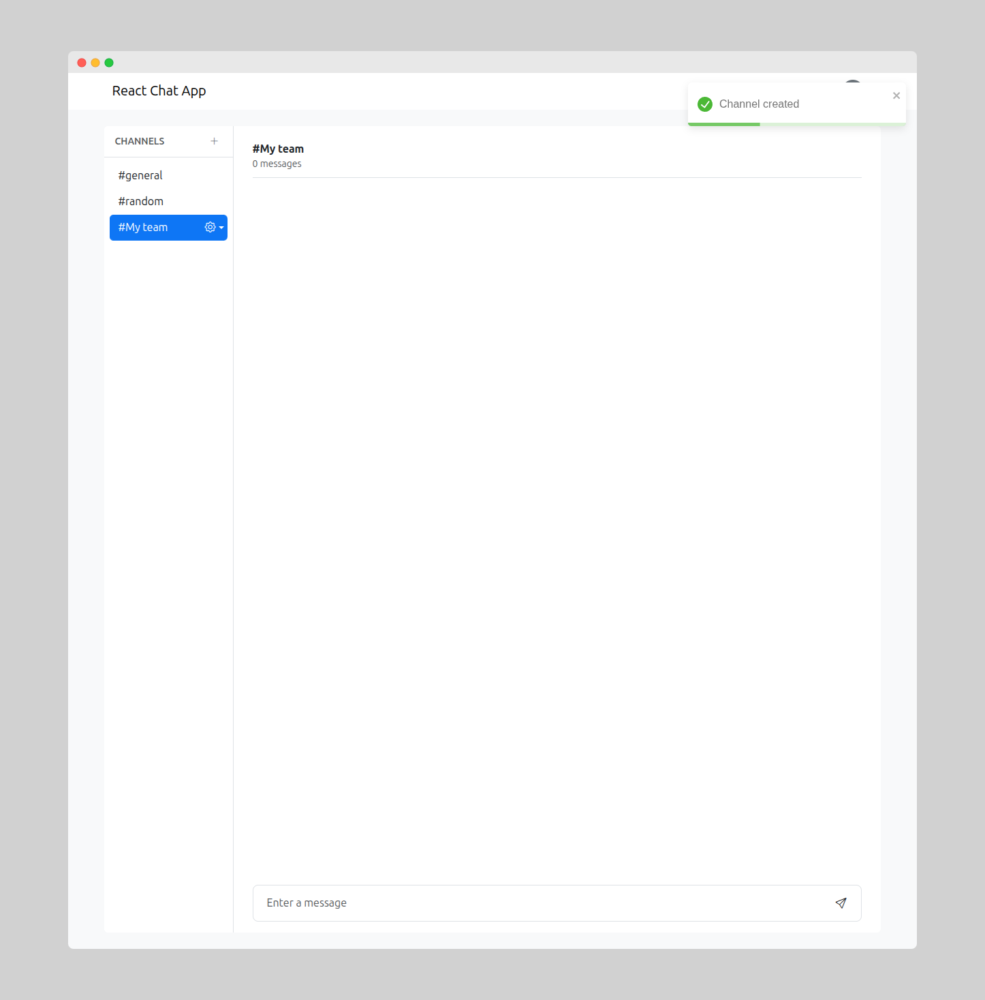
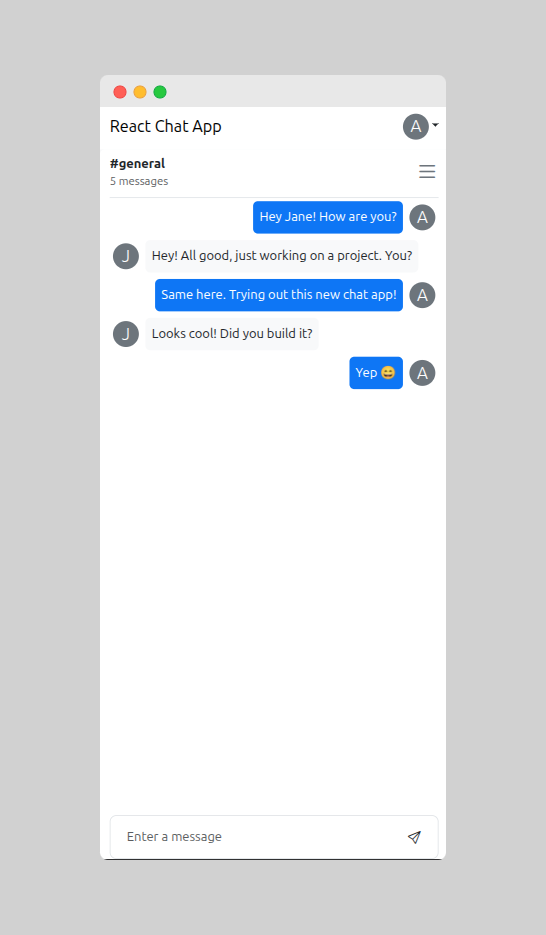
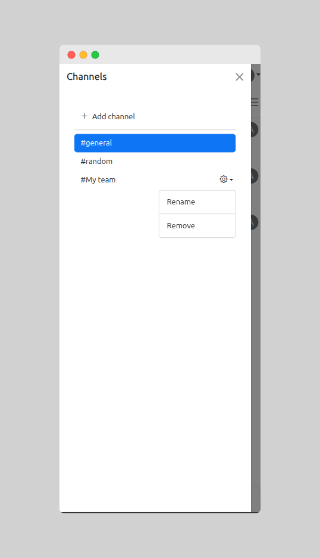
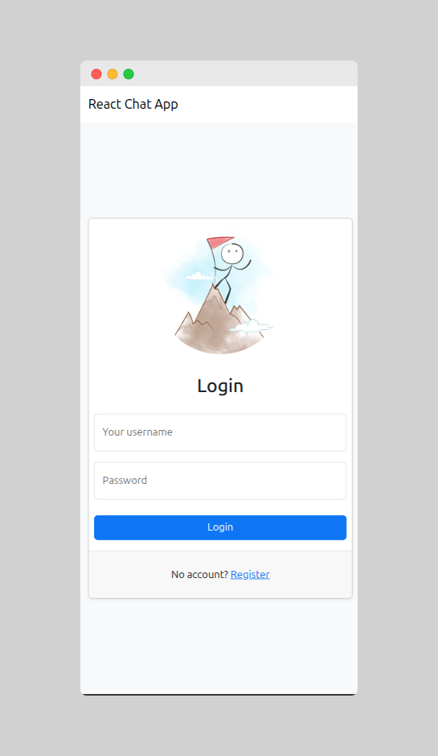

# React Chat

A simple real-time chat application built with modern technologies.

## Features

- Authentication: register and log in with a username and password
- Real-time messaging using WebSockets
- Language support: English and Russian (i18n)
- Channel management:
  - Create channels
  - Rename channels
  - Delete channels
- Profanity filter using leo-profanity
- Responsive design for mobile and desktop
- Form validation and error handling
- Notifications for user actions and errors

## Tech Stack

- React
- Redux Toolkit
- RTK Query
- WebSockets
- Bootstrap 5
- i18next
- React Toastify
- Formik and Yup
- Rollbar (error tracking)

## Demo

***Main page Desktop:***

***Creating channel Desktop:***

***Main page Mobile:***

***Channel management Mobile:***

***Login page Mobile:***

## How to run locally

```bash
git clone https://github.com/orthrus2106/React-Chat-App.git
make install
make develop
```